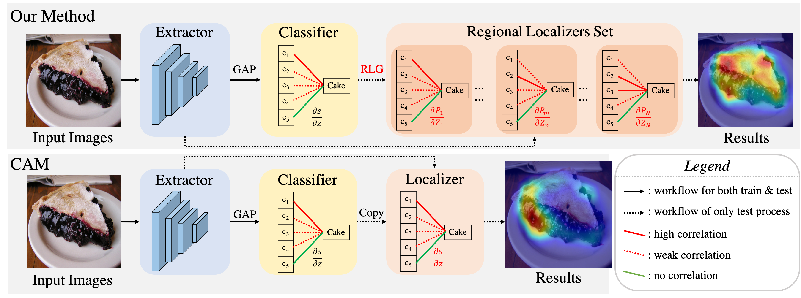
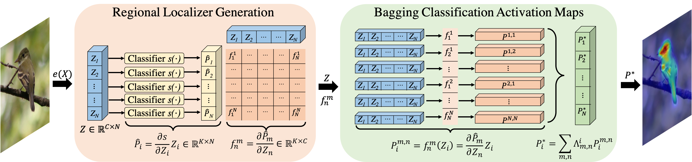

# BagCAMs

## Overview
Official implementation of the paper  ``[Bagging Regional Classification Activation Maps for Weakly Supervised Object Localization][paper_url]" (ECCV'22) 

## Bridge the Gap between image-level classifier and pixel-level localizer

The WSOL aims at training a feature extractor and a classifier based on the CE between image-level features and image-level annotation. This classifier is then directly used as the localizer onto pixel-level features in the test time to generate pixel-level classification results, i.e., the localization map. 

However, the object localizer focuses on discerning the class of all regional positions based on the pixel-level features, where discriminative factors may not be well-aggregated, i.e., insufficient to activate the globally-learned classifier.

To bridge this gap, our work proposes a plug-and-play approach called BagCAMs, which can better project an image-level trained classifier to comply with the requirement of localization tasks.

Our BagCAMs focuses on deriving a set of regional localizers from this well-trained classifier. Those regional localizers can discern object-related factors with respect to each spatial position, acting as the base learners of the ensemble learning. With those regional localizers, the final localization results can be obtained by integrating their effect.

## Getting Start

### Prepare the dataset

1. Downloading the train/test split and bounding-boxes annotation for CUB-200, OpenImages, ILSVRC dataset from [our google drive][meta_url]. 

2. Dowinloading source images and pixel-level localiztion masks of these three datasets from: 
      CUB-200 dataset: [source images][cub_image_url],  [segmentation mask][cub_mask_url]
      OpenImages dataset: [source images][open_image_url], [segmentation mask][open_mask_url]
      ILSVRC dataset: [source_images][ilsvrc_url]

3. Putting these three dataset into "$dataroot" with following layout:
 
      |--CUB 
      |    |--001.Black_footed_Albatross
      |    |--002.Laysan_Albatross
      |    |--....

      |--CUBMask
      |    |--imgs
      |    |  |--001.Black_footed_Albatross
      |    |  |--002.Laysan_Albatross
      |    |  |--....
      |    |
      |    |--masks
      |    |   |--001.Black_footed_Albatross
      |    |   |--002.Laysan_Albatross
      |    |   |--....

      |--OpenImages
      |   |--train
      |   |   |--01226z
      |   |   |--018xm
      |   |   |--....
      |   |--val
      |   |   |--01226z
      |   |   |--018xm
      |   |   |--....
      |   |--test
      |   |    |--01226z
      |   |    |--018xm
      |   |    |--....

      |--ILSVRC
          |--train
          |   |---n01440764
          |   |---01443537
          |   |---...
          |--val
          |    |--ILSVRC2012_val_00000001.JPEG
          |    |--ILSVRC2012_val_00000002.JPEG
          |    |--....

### Training baseline methods

Following [DA-WSOL][dawsol_url] to train the baseline method

### Using Our BagCAMs for Testing

1. Confirming ``$data_root" is set as the folder of datasets that has been arranged as mentioned above.

2. Downloading our checkpoint from [our google drive][checkpoint_url]. 

3. Setting ``--check_path" as the path of the checkpoint generated by training process or our released checkpoint.

4. Confirming ``--architecture" and ``--wsol_method" are consist with the setting for the trained checkpoint.

5. Set ``--post_methods" as BagCAMs (or other methods, e.g., CAM/GradCAM/GradCAM++/PCS

5. Running ``bash run_test.sh"

6. Test log files and test scores are save in "--save_dir"

### Performance

#### ILSVRC Dataset

|| Top-1 Loc | GT-known Loc | MaxBoxAccV2 | 
| :----: |:----: |:----: |:----: |
|DA-WSOL-ResNet-CAM| 43.26 | 70.27 | 68.23 | 
|DA-WSOL-ResNet-BagCAMs| 44.24 | 72.08 | 69.97 | 
|DA-WSOL-InceptionV3| 52.70 | 69.11 | 64.75 | 
|DA-WSOL-InceptionV3-BagCAMs| 53.87 | 71.02 | 66.93 | 

#### CUB-200 Dataset

|| Top-1 Loc | GT-known Loc | MaxBoxAccV2| pIoU | PxAP
| :----: |:----: |:----: |:----: |:----: |:----: |
|DA-WSOL-ResNet-CAM| 62.40 | 81.83 | 69.87 | 56.18 | 74.70 |
|DA-WSOL-ResNet-BagCAMs| 69.67 | 94.01 | 84.88 | 74.51 | 90.38 |
|DA-WSOL-InceptionV3-CAM| 56.29 | 80.03 | 68.01 | 51.81| 71.03 |
|DA-WSOL-InceptionV3-BagCAMs| 60.07 | 89.78 | 76.94 | 58.05 | 72.97 |

#### OpenImage dataset

|| pIoU | PxAP |
| :----: |:----: |:----: |
|DA-WSOL-ResNet-CAM| 49.68 | 65.42 | 
|DA-WSOL-ResNet-BagCAMs| 52.17 | 67.68 | 
|DA-WSOL-InceptionV3-CAM| 48.01 | 64.46 |
|DA-WSOL-InceptionV3-BagCAMs| 50.79 | 66.89 |

### Citation

@article\{BagCAMs, 
  title=\{Bagging Regional Classification Activation Maps for Weakly Supervised Object Localization\}, 
  author=\{Zhu, Lei and Chen, Qian and Jin, Lujia and You, Yunfei and Lu, Yanye\}, 
  journal=\{arXiv preprint arXiv:2203.01714\}, 
  year=\{2022\} 
\}

@article\{DAWSOL, 
  title=\{Weakly Supervised Object Localization as Domain Adaption\}, 
  author=\{Zhu, Lei and She, Qi and Chen, Qian and You, Yunfei and Wang, Boyu and Lu, Yanye\}, 
  journal=\{arXiv preprint arXiv:2203.01714\}, 
  year=\{2022\} 
\}

### Acknowledgement
This code and our experiments are conducted based on the release code of [gradcam][GradCAM_url] / [wsolevaluation][EVAL_url] / [transferlearning][tl_url]. Here we thank for their remarkable works.

[EVAL_url]: https://github.com/clovaai/wsolevaluation
[tl_url]: https://github.com/jindongwang/transferlearning
[GradCAM_url]: https://github.com/kazuto1011/grad-cam-pytorch

[paper_url]: https://arxiv.org/abs/2203.01714
[checkpoint_url]: https://drive.google.com/drive/folders/1NLrTq8kllz46ESfBSWJFZ638PKPDXLQ1?usp=sharing
[meta_url]: https://drive.google.com/drive/folders/1xQAjoLyD96vRd6OSF72TAGDdGOLVJ0yE?usp=sharing
[cub_image_url]: https://drive.google.com/file/d/1U6cwKHS65wayT9FFvoLIA8cn1k0Ot2M1/view?usp=drive_open
[cub_mask_url]: https://drive.google.com/file/d/1KZQLpwkuF0HgmJ04P9N9lmYvvGU9-ACP/view?usp=sharing
[open_image_url]: https://drive.google.com/file/d/1oOb4WQ-lb8SYppHEg3lWnpHk1X8WVO4e/view
[open_mask_url]: https://drive.google.com/file/d/1eu1YvcZlsEalhXTS_5Ni5tkImCliIPie/view
[ilsvrc_url]: https://image-net.org

